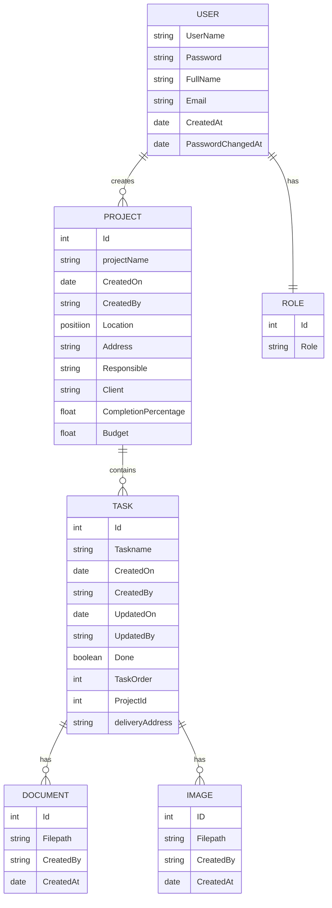

# Chain Task

## Introduction 

This project aims to ease construction project by managing each tasks and providing end user with useful infos.

## Technical Documentation

### Entity Relationship Diagram

### UML Diagram 

