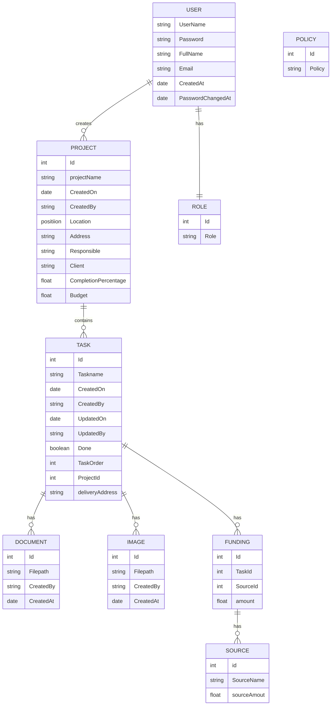
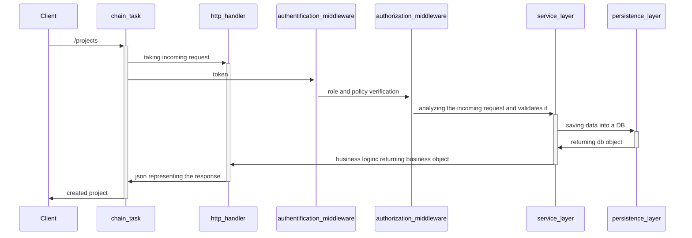

# Chain Task

## Introduction 

This project aims to ease construction project by managing each tasks and providing end user with useful infos.

## Roadmap

[Trello](https://trello.com/b/DyvI6iCi/chain-task)

## Technical Documentation

### Entity Relationship Diagram

### UML Diagram 

<!--[Click to Open Interactive Diagram](./chaintask.plantuml)-->

### Workflows

#### Authentification and Authorization

#### Policies

|RESOURCES| ADMIN  | RESPONSIBLES  |  CLIENT |
|---|---|---|---|
| LOGIN | (x)  | (x)  | (x)  |
| USERS |  CRUD on every rows | RU on him-self  |  RU on him-self   |
| PROJECTS | CRUD on every rows | RU on assigned projects | RU on assigned project |
| TASKS  | CRUD on every rows | CRUD on assigned projects | CRUD on assigned project |
| DOCUMENTS | CRUD on every rows | CRUD on assigned projects | CRUD on assigned project |
| IMAGES | CRUD on every rows | CRUD on assigned projects | CRUD on assigned project |
| FUNDINGS | no rights | no rights | CRUD on assigned project |

## Deployment

Chaintask is deployed in a [EKS cluster](https://kamalbowselvam.awsapps.com/start/) on Amazon. 

Deployment is made on each push on the  `main` branch.

[Here](http://a14b4fc8215394893b5360715edc21b1-00313d1ee7230a45.elb.eu-west-3.amazonaws.com/) is the publicly avaible URL for the deployed API. You can use [this tutoriel](https://docs.aws.amazon.com/eks/latest/userguide/create-kubeconfig.html) to set up kubectl in the CloudShell Console.