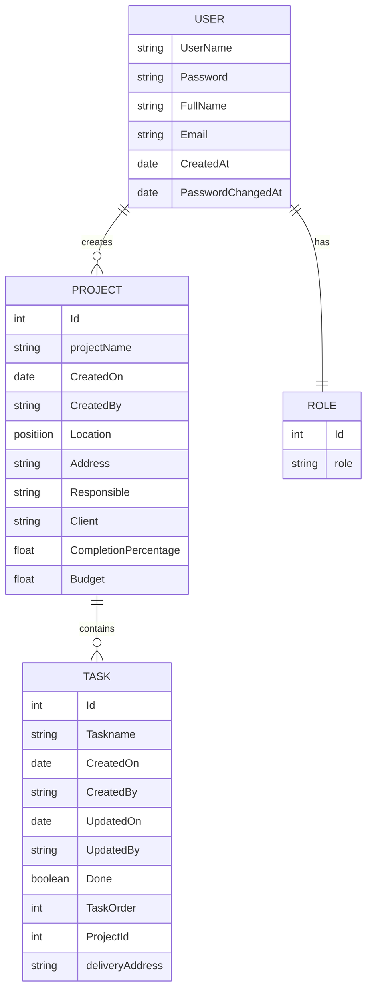

# Chain Task

#Introduction 

## Entity Relationship Diagram

```mermaid
erDiagram
    PROJECT ||--o{ TASK : contains
    USER ||--o{ PROJECT : creates
    USER ||--|| ROLE : has
    PROJECT {
        int Id
        string projectName
        date CreatedOn
        string CreatedBy
        positiion Location
        string Address
        string Responsible
        string Client
        float CompletionPercentage
        float Budget
    }
    TASK {
        int Id
        string Taskname
        date CreatedOn
        string CreatedBy
        date UpdatedOn
        string UpdatedBy
        boolean Done
        int TaskOrder
        int ProjectId
        string deliveryAddress
    }
    USER {
        string UserName
        string Password
        string FullName
        string Email
        date CreatedAt
        date PasswordChangedAt
    }
    ROLE {
        int Id
        string role
    }
```

